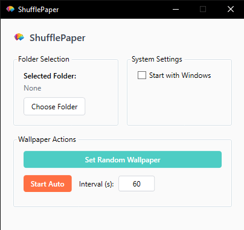

# ShufflePaper  

A lightweight Windows tray app that randomizes desktop wallpaper from a selected folder. Nothing special, I just couldn't find an app that did exactly what I needed.  

⚠️ **Note:** Should be stable, but not optimized for multiple monitors yet. Very much a work in progress.  

## ✅ Features  
- **Minimalist** – Runs quietly in the system tray  
- **Auto-Shuffle** – Changes wallpapers at customizable intervals  
- **Multi-Format** – Supports `.jpg`, `.png`, `.bmp`  

## Planned Features *(Open to suggestions!)*  
- Scaling/Stretch Modes – Fit, Fill, Stretch, Tile, etc.  
- Transitions – Fade/swipe effects between wallpapers  
- Image Preview – Quick preview before setting  
- Multi-Monitor Support – Different wallpapers per screen  
- File List – View all detected wallpapers in-app  
- Ignore List – Exclude specific images from shuffling  

## How to Use  
1. **Run** `ShufflePaper.exe`  
   - 📂 Set wallpaper folder (where you keep your image files)
   - ⏱️ Adjust shuffle interval *(if needed)*  
   - ▶️ Start / ⏹️ Stop shuffling  

## Download  
📦 **[Latest Release](https://github.com/mbarosendal/ShufflePaper/releases)** (Windows x64)  
- **Size:** ~400 KB *(requires [.NET 6 Desktop Runtime](https://dotnet.microsoft.com/download/dotnet/6.0))*  

## License  
📄 **MIT License** – Free to use and modify.  
